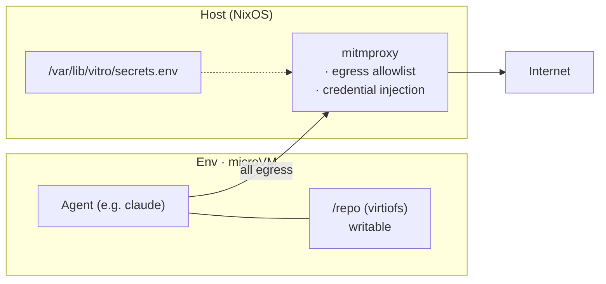

# vitro

Sandboxed microVM environments for autonomous coding agents. Each env runs
a NixOS guest with filesystem isolation, proxy-mediated egress, and
host-injected credentials. Secrets never enter the env; outbound writes
are domain-allowlisted; reads stay open by default.

> [!WARNING]
> Vitro is experimental. The security model is sound by design but the
> implementation is under active development and has not been audited.
> Do not rely on it for production security without independent review.

## What it solves

Autonomous agents that hold the [lethal trifecta][trifecta] — access to
private data, exposure to untrusted content, and the ability to
communicate externally — pose a serious security risk. Vitro keeps the
three from coexisting inside any one execution context.

[trifecta]: https://simonwillison.net/2025/Jun/16/the-lethal-trifecta/

- **Secret exfiltration.** Credentials are injected by the host proxy
  into outbound requests; the agent only ever sees placeholder values.
- **Filesystem damage.** Each env is a NixOS microVM. Only the repo is
  mounted in; no host access, no sudo, no privileged tooling.
- **Uncontrolled egress.** POSTs go through a per-env allowlist; reads
  stay open by default. Anything that doesn't match returns 403 with a
  human-readable reason.

## Architecture



The agent runtime (claude, openhands, your own script) is your choice;
vitro provides the sandbox, the proxy, the I/O surface. Persistent
agent state lives in declared `[[persist]]` mounts so OAuth tokens,
conversation history, build caches etc. survive env rebuilds.

## Install

### Client (your laptop)

```bash
nix profile install github:ixxie/vitro
```

NixOS users can opt into the client module:

```nix
vitro.client = {
  enable = true;
  user = "me";
  server = "grove";
  servers.grove = "root@1.2.3.4";
};
```

The server registry is declarative — the NixOS module materializes
`~/.config/vitro/servers.toml`. Non-Nix users hand-edit the same file:

```toml
# ~/.config/vitro/servers.toml
[grove]
target = "root@1.2.3.4"
```

`vitro server list` reads it.

### Server

A NixOS module. Use it anywhere you manage NixOS — dotfiles, colmena,
deploy-rs, or a dedicated repo.

```nix
{
  inputs.vitro.url = "github:ixxie/vitro";

  outputs = { nixpkgs, vitro, ... }: {
    nixosConfigurations.grove = nixpkgs.lib.nixosSystem {
      modules = [
        vitro.nixosModules.server
        { vitro.server.enable = true; }
      ];
    };
  };
}
```

For standalone server repos, `vitro.lib.mkHost` is a minimal wrapper.
Deploy with `vitro server deploy [host-dir]` — auto-detects whether to
`nixos-rebuild --target-host` or bootstrap via `nixos-anywhere`.

## Per-repo configuration

Each repo gets a `.vitro/` directory describing its env. Two files
matter: `config.toml` (resources, egress, secrets, persist) and
optionally `flake.nix` (guest NixOS module — extra packages, files,
services).

### Example: vitro's own `.vitro/`

Vitro is developed inside vitro. The repo's own config is the canonical
example.

`.vitro/config.toml`:

```toml
memory = "8192M"
vcpu = 4
server = "grove"

[egress]
writes.allowed = [
    "api.anthropic.com",
    "statsig.anthropic.com",
    "platform.claude.com",
    "api.github.com",
    "registry.npmjs.org",
    "openrouter.ai",
]

[[egress.credentials]]
host = "openrouter.ai"
header = "Authorization"
env_var = "OPENROUTER_API_KEY"

[[egress.credentials]]
host = "api.github.com"
header = "Authorization"
env_var = "GITHUB_TOKEN"

[[persist]]
path = "/home/agent/.claude"
purpose = "claude OAuth state and session history"

[[persist]]
path = "/var/log/vitro"
purpose = "session log archives"

[secrets]
keys = ["ssh-ed25519 AAAAC3NzaC1lZDI1NTE5AAAA…"]
```

What this declares:

- 8 GB / 4 vCPU env on the `grove` server (`server` resolves via the
  client registry)
- Outbound writes (POST/PUT/PATCH/DELETE) only allowed to the listed
  hosts; reads stay default-open
- Two credential-injection rules — the proxy adds `Authorization: Bearer
  $OPENROUTER_API_KEY` (resp. GitHub token) to outbound requests; the
  agent only sees a placeholder
- Two paths persisted across env rebuilds via virtiofs shares to host
  storage
- An age recipient list for the encrypted `secrets.age` (vitro accepts
  ssh-ed25519 pubkeys natively)

`.vitro/flake.nix` (optional — guest NixOS module):

```nix
{
  inputs.nixpkgs.url = "github:NixOS/nixpkgs/nixpkgs-unstable";
  outputs = { nixpkgs, ... }: {
    nixosModule = { pkgs, lib, ... }: {
      # Skip claude's per-tool prompts — the vitro sandbox is the boundary.
      systemd.services.claude-settings = {
        wantedBy = [ "multi-user.target" ];
        after = [ "local-fs.target" ];
        serviceConfig.Type = "oneshot";
        script = let
          settings = builtins.toJSON {
            permissions.defaultMode = "bypassPermissions";
            permissions.skipDangerousModePermissionPrompt = true;
          };
        in ''
          mkdir -p /home/agent/.claude
          echo ${lib.escapeShellArg settings} > /home/agent/.claude/settings.json
          chown -R agent:users /home/agent/.claude
        '';
      };
    };
  };
}
```

Anything valid in a NixOS module works: install packages, mount
filesystems, drop config files, define systemd units. The module
composes with vitro's guest base.

## Workflow

```bash
vitro create <env>     # provision microvm + seed bare repo from laptop HEAD
vitro shell <env>      # interactive PTY into the env (ProxyJump via server)
vitro shell <env> -c "<cmd>"   # one-shot command
vitro list             # list envs across all known servers
vitro status <env>     # env state, IP, repo, etc.
vitro logs <env> [-f]  # tail the env's proxy activity (operator-side, via SSH)
vitro rebuild <env>    # rebuild microvm derivation (for VM-config changes)
vitro stop <env>       # stop the VM (data preserved)
vitro remove <env>     # tear down env entirely
vitro tunnel <env> -p 5173 [-o]  # forward port from env to laptop
```

Typical session:

```bash
cd ~/repos/vitro
vitro create vitro-dev    # ~30s — boots the VM, pushes HEAD
vitro shell vitro-dev     # drops you into /vitro inside the env
# inside the env:
claude                    # already configured with bypassPermissions
```

### Reload semantics

- **Soft reload — automatic.** Editing `.vitro/config.toml` (egress,
  credentials) takes effect on the next `vitro shell` or `vitro create`
  without restarting the VM. No downtime, no process loss.
- **Hard rebuild — explicit (`vitro rebuild`).** VM-config changes
  (memory, vcpu, persist paths, `.vitro/flake.nix`) are baked into the
  microvm derivation. Rebuild reboots the guest — running processes
  including agent sessions die. Persist mounts and the bare repo
  survive.

### Git surface

`vitro create` registers a `vitro` git remote pointing at the env's bare
repo on the server. Use it like any remote:

```bash
git push vitro              # send laptop work to the env
git fetch vitro             # pull env-side commits back
git merge vitro/main        # integrate them
```

After the initial seed, vitro does *not* auto-push on subsequent shells
— the env is the source of truth for in-env agent work.

## Secrets

Encrypted at rest in `.vitro/secrets.age`, decrypted on the laptop using
one of the recipients listed in `[secrets].keys`, then pushed to the
server over the SSH session that runs the env. **The host never holds
an age key**, so adding a new server is `vitro server deploy` — no
host-pubkey dance.

```bash
vitro secrets edit         # decrypt → $EDITOR → re-encrypt
vitro secrets encrypt      # .vitro/secrets.env → .vitro/secrets.age
vitro secrets decrypt      # .vitro/secrets.age → .vitro/secrets.env (gitignored)
```

The proxy reads the plaintext envfile on the host and uses it for
credential injection. Inside the env, secrets never appear as env vars,
files, or HTTP request bodies — only as injected headers on requests to
permitted hosts.

For a custom secret manager:

```toml
[secrets]
command = "sops -d .vitro/secrets.yaml"
```

The command must output `KEY=VALUE` lines.

## Observability

When the proxy blocks a request, the 403 body explains why:

```
Blocked by vitro proxy.
  env:    vitro-dev
  host:   platform.claude.com
  method: POST (classified as writes)
  path:   /v1/oauth/token

To allow this request, add 'platform.claude.com' to
[egress].writes.allowed in .vitro/config.toml and recreate the env.
```

For tracing across requests:

```bash
vitro logs <env>           # last 50 events
vitro logs <env> -f        # follow live
```

Server-side, the addon writes per-env activity to
`/var/log/vitro/per-env/<env>.log` and global activity to
`/var/log/vitro/proxy.log`. **Logs are not mounted into the env** —
the agent can't introspect credential-injection mechanics from
`NOAUTH` events or future addon logging.

## Threat model

### Secret exfiltration

A prompt injection instructs the agent to read API keys and send them
to an attacker-controlled endpoint.

- Secrets never enter the env. The proxy injects them only on outbound
  requests matching a `[[egress.credentials]]` rule.
- Even if a placeholder is read by the agent, it's not the real value.
- Egress allowlist limits where any data can be POSTed.

### Filesystem damage

The agent modifies host files, installs persistent malware, or corrupts
system state.

- Each env is a NixOS microvm with its own filesystem.
- Only the repo dir is mounted via virtiofs; `/cella`, `/vitro`, etc.
  are the only writable host-shared paths.
- No sudo. No root. `vitro remove <env>` wipes everything.

### Network-mediated exfiltration

The agent constructs requests to allowed hosts (e.g. `github.com`) that
encode secrets in URL paths or bodies.

- Currently mitigated only by the small allowlist surface.
- The proxy logs every outbound write; per-host body inspection is
  *capable* but not currently configured.
- This is the most realistic remaining attack vector. Keep the
  allowlist minimal.

## NixOS module effects

### Server module (`vitro.nixosModules.server`)

**Network:** `cellbr` bridge on `192.168.83.0/24`, systemd-networkd
for VM tap devices, NAT masquerading.

**Firewall (nftables):** default-drop for envs — only proxy ports
(8080–8082) and SSH (22) reachable.

**DNS:** dnsmasq on the bridge serving env hostnames; does not affect
host DNS.

**Services:** `vitro-mitmproxy` (egress filtering + credential
injection), `vitro-services` (control API), `vitro-ca-sync`,
`vitro-hostkey`, optional `vitro-gc` timer.

**Filesystem:** `/var/lib/vitro/` (envs, IP pool, DNS hosts, CA certs,
secrets); `/var/log/vitro/` (proxy and per-env logs).

### Client module (`vitro.nixosModules.client`)

**`/etc/hosts`:** writable mode so `vitro tunnel` can register
hostnames.

**Config files:** materializes `~/.config/vitro/servers.toml` and
`~/.config/vitro/config.toml`.

**Sudo (passwordless, narrowly scoped):**
- `ip addr add/del 127.*/8 dev lo` — loopback aliases for tunnels
- `vitro util hosts add/remove` — `/etc/hosts` manipulation
