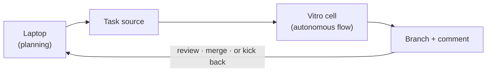
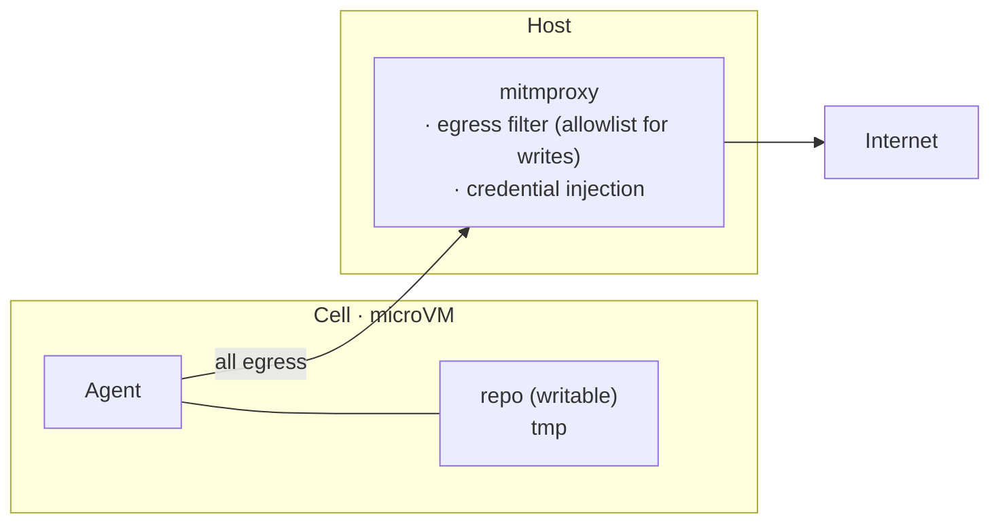

# vitro

Sandboxed execution for autonomous coding agents. Each task runs in an
isolated NixOS microVM (a "cell") with proxy-mediated egress and injected
credentials. Secrets never enter the cell. Outbound writes are
allowlisted by domain.

> [!WARNING]
> Vitro is experimental. The security model is sound in design but the
> implementation is under active development and has not been audited.
> Do not rely on it for production security without independent review.

## What it solves

Fully autonomous agents that possess the [lethal trifecta][trifecta] —
access to private data, exposure to untrusted content, and the ability
to communicate externally — pose a serious security risk. Vitro keeps
the three from coexisting inside any one execution context.

[trifecta]: https://simonwillison.net/2025/Jun/16/the-lethal-trifecta/

- **Secret exfiltration.** Secrets never enter the cell; the proxy
  injects credentials into outbound requests on the fly.
- **Filesystem damage.** Each cell is a NixOS microVM with its own
  filesystem. Only the repo is mounted; no host access, no sudo.
- **Uncontrolled egress.** POSTs go through an allowlist by domain;
  reads stay open by default.

## Architecture



A cell is the unit of agentic work. What runs inside is the user's
concern. Vitro provides the sandbox, the proxy, and the I/O surface.

The substrate solves *bounded autonomous tasks*: an agent runs a
defined piece of work, produces a git branch, exits. Multi-step
orchestration (retries, validation loops, scheduling) lives in user
code, not in the substrate.

### Scope

**In core:** microVM lifecycle, egress proxy + credential injection,
age-based secrets, deploy (`nixos-rebuild` / `nixos-anywhere`), a
per-cell git remote with worktree workflow, `.cell` DNS tunnels.

**Out of core:** flow engines (transitions, retries, middleware,
op-level rules), and multi-orchestrator DSLs — user code or any
ACP-speaking agent runtime handles this. Vitro is runtime-agnostic.

## Install

### Client (your laptop)

```bash
# binary (macOS, Linux)
curl -fsSL https://github.com/ixxie/vitro/releases/latest/download/install.sh | sh

# nix (any OS with nix installed)
nix profile install github:ixxie/vitro
```

NixOS users can opt into the client module:

```nix
vitro.client = {
  enable = true;
  user = "me";
  server = "prod";
  vmConfig = ./vm;
  servers.prod = "root@1.2.3.4";
  sync = ["~/.claude.json"];
};
```

The server registry is declarative — the NixOS module materializes
`~/.config/vitro/servers.toml`. Non-Nix users hand-edit the same file:

```toml
# ~/.config/vitro/servers.toml
[prod]
target = "root@1.2.3.4"
```

`vitro server list` reads it.

### Server

A NixOS module. Use it anywhere you manage NixOS — dotfiles, colmena,
deploy-rs, or standalone repos.

```nix
{
  inputs.vitro.url = "github:ixxie/vitro";

  outputs = { nixpkgs, vitro, ... }: {
    nixosConfigurations.myhost = nixpkgs.lib.nixosSystem {
      modules = [
        vitro.nixosModules.server
        {
          vitro.server.enable = true;
          environment.systemPackages = [
            vitro.packages.x86_64-linux.default
          ];
        }
      ];
    };
  };
}
```

For standalone server repos, `vitro.lib.mkHost` provides a minimal
wrapper:

```nix
vitro.lib.mkHost { inherit vitro nixpkgs disko; } {
  name = "myhost";
  disk = ./disk.nix;
  sshPubkey = "ssh-ed25519 AAAA...";
}
```

## Configuration

Per-repo config lives in `.vitro/config.toml`:

```toml
memory = "4096M"
vcpu = 2
server = "prod"
ports = [5173]
post_push = "bun install"

[secrets]
keys = ["ssh-ed25519 AAAA..."]

[egress]
writes.allowed = ["api.linear.app", "api.anthropic.com"]

[[egress.credentials]]
host = "api.linear.app"
header = "Authorization"
env_var = "LINEAR_API_KEY"
```

Server resolution: CLI `-s` > repo `server` > client default > scan
running cells > localhost.

## Secrets

Vitro manages secrets so they never enter the VM. The proxy reads
`/var/lib/vitro/secrets.env` on the host and injects credentials into
outbound requests based on the egress credential rules.

```bash
vitro secrets edit                  # decrypt, edit, re-encrypt
vitro secrets encrypt               # encrypt .vitro/secrets.env → .age
vitro secrets decrypt               # decrypt .age → .vitro/secrets.env
```

The encrypted `.vitro/secrets.age` is committed to the repo; the
plaintext `.vitro/secrets.env` is gitignored. **Decryption happens on
your laptop** using your SSH key (one of your team's recipients in
`[secrets].keys`); the resulting plaintext is pushed to the host over
the same SSH session that runs the cell. The host never holds an age
key, so adding a new server is just `vitro server deploy`, no
host-pubkey dance.

For a custom secret manager:

```toml
[secrets]
command = "sops -d .vitro/secrets.yaml"
```

The command must output `KEY=VALUE` lines to stdout.

## Usage

All commands run from inside a git repo. Each cell is a branch with its
own isolated VM, local worktree, and the repo mounted at `/<repo-name>`.

### Branch lifecycle

```bash
vitro create feat                  # new branch + worktree + cell
vitro create feat --server prod    # also bind the cell to a server
vitro add feat                     # adopt existing branch
vitro remove feat                  # tear down worktree + cell
vitro remove feat -d               # also delete the git branch
vitro list [--json]                # list vitro-managed branches
vitro path feat                    # print worktree path
vitro switch feat                  # cd into worktree (requires shell hook)
```

`--server` on `create` / `add` persists the binding at
`.vitro/state/<cell>/server` so subsequent `vitro run`/`logs`/`status`
calls route there without an explicit `--server` each time.

### Running flows

A "flow" is a script at `.vitro/flows/<name>.ts` (or any extension —
`.sh`, `.py`, etc.). Vitro execs the script inside the cell with a set
of `VITRO_*` env vars; the script is responsible for everything else.

```bash
vitro run [<cell>] [<flow>]            # exec .vitro/flows/<flow>.ts
vitro run [<cell>] -c "<cmd>"          # ad-hoc command, ignores flows/
vitro run [<cell>] -d                  # detach
vitro run [<cell>] -- key=val          # → VITRO_PARAM_KEY env var
vitro logs [<cell>] [-f] [--json]      # view output (--json emits JSONL)
vitro status [<cell>] [--json]         # cell status
vitro shell [<cell>] -c "<cmd>" --json # capture exit_code/stdout/stderr/duration_ms
vitro stop [<cell>]                    # stop cell, data preserved
```

If only one flow exists in `.vitro/flows/`, `vitro run` resolves to it
without naming. Otherwise specify which. `vitro run` always pushes the
cell branch before invoking the flow, so edits to flow files take
effect immediately — no need to `vitro stop` to refresh.

A flow declares its own dependencies via [nix shebangs][nix-shebang].
For shells that treat `#` as a comment (bash, python), the canonical
multi-line form works:

```bash
#!/usr/bin/env nix-shell
#! nix-shell -i bash --pure
#! nix-shell -p curl jq
#! nix-shell -I nixpkgs=https://github.com/NixOS/nixpkgs/archive/<commit>.tar.gz
```

JS/TS runtimes (bun, node) only honor a shebang on line 1 and reject
the subsequent `#!` directives as parse errors. The standard workaround
is a tiny bash launcher exec'ing the real interpreter:

```
.vitro/flows/build.sh    # bash wrapper — what `vitro run cell build` resolves
.vitro/build.ts          # pure TS impl, no shebang
```

```bash
# build.sh
#!/usr/bin/env nix-shell
#! nix-shell -i bash
#! nix-shell -p bun nodejs
#! nix-shell -I nixpkgs=https://github.com/NixOS/nixpkgs/archive/<commit>.tar.gz
exec bun "$(dirname "$0")/../build.ts" "$@"
```

The default cell has nix + git + sshd; everything language-specific is
pulled in by the shebang. Different flows can pin different nixpkgs
revisions and not conflict.

[nix-shebang]: https://nix.dev/tutorials/first-steps/reproducible-scripts.html

### Env vars in flows

| Variable | Description |
|---|---|
| `VITRO_CELL` | Cell name |
| `VITRO_BRANCH` | Git branch |
| `VITRO_REPO` | Repo name (mount path inside cell) |
| `VITRO_SERVER` | Server cell runs on |
| `VITRO_PARAM_<KEY>` | From `vitro run -- key=value` |

### Interactive use

```bash
vitro shell <cell>                  # interactive SSH
vitro shell <cell> -c "<cmd>"       # exec one command
```

### ACP — drive a cell from an external agent client

`vitro acp <cell>` exposes a cell as an [Agent Client Protocol] provider:
stdin/stdout carries JSON-RPC between an in-cell agent process and an
ACP client (e.g. [Paseo]). The substrate handles routing, secrets push,
and code sync; the agent runs sandboxed inside the cell.

[Agent Client Protocol]: https://paseo.sh/docs/custom-providers
[Paseo]: https://paseo.sh

Declare the in-cell agent command in `.vitro/config.toml`:

```toml
[acp]
command = ["claude-code", "--acp"]
# or any ACP-speaking binary
```

Then point your ACP client at vitro. For Paseo, in its config:

```json
{
  "agents": {
    "providers": {
      "dogfood-1": {
        "extends": "acp",
        "label": "Vitro: dogfood-1",
        "command": ["vitro", "acp", "dogfood-1"]
      }
    }
  }
}
```

Each spawn is one session — concurrent sessions on the same cell are
fine (no run-pid lock). Works the same whether Paseo runs on your laptop
(SSH path: laptop → server → cell) or on the host (server → cell).

### Git interaction

Vitro registers a `vitro` git remote at cell creation; plain git from
there:

```bash
git fetch vitro                    # fetch agent's commits
git diff vitro/feat                # review changes
git pull vitro feat                # merge into current branch
```

### Dev servers

```bash
vitro tunnel <cell> -p 5173        # forward port with .cell DNS
vitro tunnel <cell> -p 5173 -o     # also open in browser
vitro tunnel <cell> -p 5173 -p 8000-8010
```

### Servers and deployment

```bash
vitro server list                              # read-only registry
vitro server deploy [host-dir]                 # bootstrap NixOS or update in place
vitro server deploy --boot --reboot            # activate at next boot, then reboot
vitro server gc --older-than 7d                # delete stopped cells older than N
```

`vitro server deploy` auto-detects the target OS:
- Already NixOS → updates via `nixos-rebuild --target-host` (builds on
  the laptop, copies the closure, activates remotely)
- Not NixOS → bootstraps via `nixos-anywhere`

`--boot` activates at next boot rather than live-switching — useful
when nixos-rebuild blocks the switch (dbus implementation changes,
kernel updates, etc.). `--reboot` chains a reboot after a successful
boot-mode deploy.

### Machine-readable output

`--json` is supported on the inspection commands. Stable shapes:

```json
// vitro list --json
{ "cells": [{
    "name": "feat-x", "branch": "feat-x", "server": "prod",
    "status": "running", "ip": "192.168.83.42", "repo": "myrepo",
    "worktree": "/repo/.vitro/trees/feat-x",
    "started_at": null, "last_run": null
}]}

// vitro status <cell> --json
{
  "name": "feat-x", "status": "running", "ip": "192.168.83.42",
  "process": { "running": true, "pid": null, "started_at": null },
  "git": { "head": "abc1234", "ahead": 3, "behind": 0 }
}

// vitro shell <cell> -c "..." --json
{ "exit_code": 0, "stdout": "...", "stderr": "...", "duration_ms": 1234 }

// vitro logs <cell> --json (JSONL, one line per event)
{"ts": 1730000000, "stream": "stdout", "line": "..."}
```

Fields the substrate doesn't yet track (`started_at`, `last_run`,
`process.pid`) are emitted as `null` rather than missing, so consumers
see a consistent schema.

## Anatomy

The **proxy** is the core security boundary. It sits between the cell
and the internet, injecting credentials into outbound requests and
filtering egress by HTTP method and domain. Secrets never enter the VM.



## Threat model

### Secret exfiltration

**Threat:** A prompt injection instructs the agent to read API keys and
send them to an attacker-controlled endpoint.

**Defense:** Secrets never enter the cell. The proxy injects credentials
into outbound requests on the fly. Inside the VM, there are no
environment variables, files, or config containing secrets. Write access
is restricted by an egress allowlist — the agent can only POST to
domains you explicitly permit.

### Filesystem damage

**Threat:** The agent modifies host files, installs persistent malware,
or corrupts system state.

**Defense:** Each cell is a NixOS microVM with its own isolated
filesystem. The repository is mounted via VirtioFS — the agent can
modify repo contents but has no access to the host filesystem. There
is no sudo, no root access. `vitro remove -d` wipes a cell completely.

## NixOS module effects

Both modules are opt-in (`enable = true`) and only modify the system
when explicitly enabled.

### Server module (`vitro.nixosModules.server`)

**Network:**
- Bridge interface (`cellbr` on `192.168.83.0/24`)
- systemd-networkd for VM tap devices
- NAT masquerading, `net.ipv4.ip_forward = 1`

**Firewall (nftables):**
- Default-drop for cells — only proxy (8080), git credentials (8081),
  SSH (22)

**DNS:**
- dnsmasq on bridge serving `.cell` hostnames
- Only listens on bridge — does not affect host DNS

**Services:**
- `vitro-mitmproxy` — egress filtering + credential injection
- `vitro-services` — control API (cell lifecycle)
- `vitro-ca-sync` — mitmproxy CA cert extraction
- `vitro-hostkey` — SSH keypair for server-side VM access
- `vitro-gc` (optional timer) — periodic GC of stopped cells

**Filesystem:**
- `/var/lib/vitro/` — cells, IP pool, DNS hosts, CA certs, secrets
- `/var/log/vitro/` — proxy and service logs

### Client module (`vitro.nixosModules.client`)

**`/etc/hosts`:**
- Writable mode so `vitro tunnel` can add `.cell` entries at runtime

**Config files:**
- `~/.config/vitro/servers.toml` from `servers` option
- `~/.config/vitro/config.toml` from `server` and `sync` options

**VM config (localhost):**
- Copies `vmConfig` to `/var/lib/vitro/vm-config/`

**Sudo rules (passwordless):**
- `ip addr add/del 127.*/8 dev lo` — loopback aliases for tunnels
- `vitro util hosts add/remove` — `/etc/hosts` manipulation
